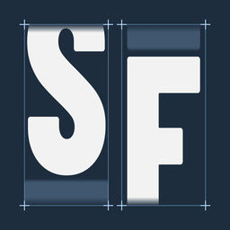

<div align="center">



# SplitflapKit

**Split-flap departure-board text for SwiftUI and UIKit — every letter rolls, flips or flickers into place, played by Core Animation**

[](https://swiftpackageindex.com/enavermate/SplitflapKit)
[](Package.swift)
[](LICENSE)

</div>

<p align="center"><br /><sub>Emoji: <a href="https://github.com/jdecked/twemoji">Twemoji</a>, <a href="https://creativecommons.org/licenses/by/4.0/">CC-BY 4.0</a></sub></p>

```swift
import SplitflapKit

Splitflap(gate)
    .splitflapTransition(.flip(surface: .black))
    .splitflapFont(size: 28, weight: .bold)
```

## ✨ Features

- 🎰 **Four transitions** — `flip`, `reel`, `roll` and `scramble`, for words and for numbers
- 🔤 **Any text, any script** — Latin, Cyrillic, Greek, Armenian, Georgian, the Indic and Southeast
  Asian scripts, the kana and many numeral systems roll through their own alphabets; any other
  character still changes, in one step. Flags, emoji and Indic syllables stay whole in one cell
- 📏 **Cells that keep still** — tabular digits by default, and two cell widths: text-like `natural`
  and `uniform`, a station board's fixed cells
- ⚡ **Core Animation** — every glyph is rasterised once into an atlas and every change is baked into
  keyframes, so the motion runs in the render server, not in your code
- 🔁 **Interruptible** — a new text mid-flight continues from where every cell is, without a jump
- ⏳ **Loading built in** — random words spin while data loads, then the real text lands
- ♿ **Accessible** — one static-text element with the full text, Dynamic Type and Reduce Motion
- 📐 **Lays out like a label** — intrinsic size of a one-line `UILabel` in the same font, `…` when
  narrower
- 🧩 **SwiftUI and UIKit** — `Splitflap` and `SplitflapView`, iPhone, iPad and the Mac through Mac Catalyst, no dependencies

## 📦 Installation

Swift Package Manager — in Xcode, **File → Add Package Dependencies…** and paste:

```
https://github.com/enavermate/SplitflapKit
```

or in `Package.swift`:

```swift
.package(url: "https://github.com/enavermate/SplitflapKit", from: "0.5.0")
```

iOS and iPadOS 15 or later, and Mac Catalyst 15 or later.

## 🚀 Quick start

**SwiftUI**

```swift
struct Gate: View {
    @State private var status = "BOARDING"

    var body: some View {
        Splitflap(status)
            .splitflapTransition(.flip(surface: .black))
            .splitflapCellWidth(.uniform)
            .splitflapFont(size: 32, weight: .bold, design: .monospaced)
            .splitflapColor(.yellow)
    }
}
```

A new string turns in from the one on screen. Modifiers apply to every `Splitflap` below them, so a
whole board takes one `.splitflapTransition`.

**UIKit**

```swift
let board = SplitflapView(text: "MADRID")
board.font = .systemFont(ofSize: 32, weight: .bold)
board.transition = .roll()
view.addSubview(board) // Auto Layout: it has an intrinsic size, like a label

board.text = "LISBOA"
```

## 🎞️ Transitions

| Transition                 | What every changed letter does                                                                    |
| -------------------------- | ------------------------------------------------------------------------------------------------- |
| `.reel()` _(default)_      | Spins through the alphabet between the old letter and the new one, like a slot machine reel       |
| `.roll()`                  | Rolls through a few letters: its neighbours when the new one is close, random ones when it is far |
| `.flip(surface:)`          | Flips over in halves, like a departure board                                                      |
| `.scramble`                | Flickers through random letters of its own script, then locks                                     |

`flip` paints its flaps solid so the half they cover never shows through: `surface` is the colour
right under the text, and the flaps vanish into it. `reel` and `roll` take a direction:
`.random` (default — every other cell from above), `.auto` (each cell the way its letter lies in the
alphabet), `.up`, `.down`.

```swift
Splitflap(weekday).splitflapTransition(.roll(direction: .auto))
```

## 📏 Cell width

| `SplitflapCellWidth` | Behaviour                                                                                        |
| -------------------- | ------------------------------------------------------------------------------------------------ |
| `.natural`           | A cell moves from the old glyph's width to the new one's, as text reflows. `reel` and `roll` only |
| `.uniform`           | Every cell as wide as the alphabet's widest letter, each glyph centred — a station board         |

Without one, `reel` and `roll` reflow like text, and `flip` and `scramble` keep every letter close to
its own width — narrow, regular and wide cells measured from the text's alphabets — since they show
two glyphs in one cell at once and must not reflow.

## ⚙️ API

**SwiftUI modifiers**

| Modifier                                        | What it sets                                                         |
| ----------------------------------------------- | -------------------------------------------------------------------- |
| `.splitflapTransition(_:)`                      | `.reel()`, `.roll()`, `.flip(surface:)`, `.scramble`                 |
| `.splitflapCellWidth(_:)`                       | `.natural` (`reel`, `roll`), `.uniform`; nil for the default         |
| `.splitflapTiming(duration:stagger:order:)`     | seconds per cell (0.65), seconds between cells (0.04), `.ltr` `.rtl` `.random` |
| `.splitflapAlphabet(_:)`                        | `.auto`, `.script(.greek)`, `.letters("0123456789ABCDEF")`           |
| `.splitflapLoading(_:length:)`                  | random words until false; `.cells(4)` or `.range(min: 4, max: 10)`  |
| `.splitflapFont(_:)`, `.splitflapFont(size:weight:design:)` | the glyphs' font, scaled with Dynamic Type                |
| `.splitflapColor(_:)`, `.splitflapLetterSpacing(_:)`, `.splitflapTabularDigits(_:)` | colour, tracking, digits of one width (on) |
| `.splitflapSeed(_:)`                            | the same seed plays the same way                                     |
| `.splitflapContentKey(_:)`, `.splitflapAnimatesOnAppear(_:)` | lists: replan a reused row, show the first text at once |
| `.splitflapReduceMotion(_:)`                    | `.system` (default), `.always`, `.never`                             |
| `.onSplitflapTransitionStart(_:)`, `.onSplitflapTransitionEnd(_:)` | the text, and whether a newer text interrupted it |

**UIKit** — `SplitflapView` has the same settings as properties: `text`, `transition`, `cellWidth`,
`duration`, `stagger`, `staggerOrder`, `alphabet`, `isLoading`, `loadingLength`, `seed`, `font`,
`textColor`, `letterSpacing`, `lineHeight`, `usesTabularDigits`, `adjustsFontForContentSizeCategory`,
`reduceMotion`, `animatesOnAppear`, `contentKey`, `onTransitionStart`, `onTransitionEnd`.

**The planner** — `createBoard()`, `planTransition(_:_:)` and `loadingPlan(_:seed:options:)` return
every cell's path, timing and direction as plain data, so a board's behaviour can be tested without
rendering, or drawn some other way.

## 🔤 Scripts

A cell rolls through the alphabet of its own letter's script, read from the text — no language
setting. A word travels only through the core letters and the extra letters it contains, so a
Ukrainian word never flashes a letter only Belarusian uses. Chinese, Korean and anything else without
an alphabet changes in one step: no script can break a board. Right-to-left scripts are not supported.

## 🌍 Also for React Native

The same board, plan for plan: [react-native-splitflap](https://github.com/enavermate/react-native-splitflap)
(`npx expo install @enavermate/react-native-splitflap`). SplitflapKit's planner is a line-by-line port
checked against 131 scenarios of the TypeScript one, so a text animates the same way in both.
How it is built: [scivi.dev/oss/react-native-splitflap](https://scivi.dev/oss/react-native-splitflap).

## 🧪 Demo

`Examples/SplitflapDemo` — open `SplitflapDemo.xcodeproj` and run it on an iPhone, an iPad or, as a Mac Catalyst app, on the Mac.

## 🤝 Contributing

Found a bug, or missing something? [Open an issue](https://github.com/enavermate/SplitflapKit/issues/new/choose).
See [CONTRIBUTING](CONTRIBUTING.md); everyone taking part follows the [code of conduct](CODE_OF_CONDUCT.md).

## 📄 License

[MIT](LICENSE) © Roman Diukachov
